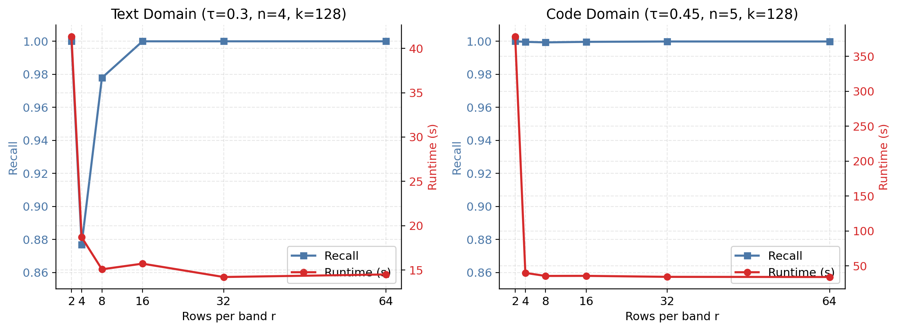
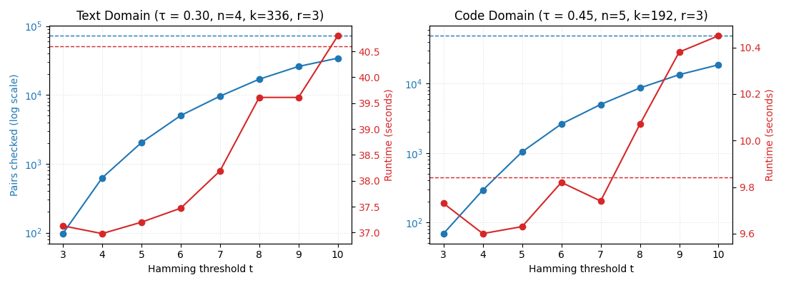

# Detailed Experimental Results

**Datasets**

- Text dataset: [WikiText-103-raw-v1](https://huggingface.co/datasets/Salesforce/wikitext)
- Code dataset: [CodeSearchNet (Python subset)](https://huggingface.co/datasets/Nan-Do/code-search-net-python)

Before doing any approximate deduplication, all exact string duplicates were removed.

After that cleanup:

- **WikiText-103:** 89,145 / 100,000 unique files
- **CodeSearchNet:** 100,000 / 100,000 unique files

All experiments below use subsets from these filtered datasets.

**Baseline for agreement:** 1K/10K compare against exact Jaccard; 100K compares against plain LSH.

---

## **Small Scale — 1K Files (Exact Jaccard Baseline)**

The first 1,000 remaining files from each dataset were compared using **Jaccard similarity**. Each file is tokenized and converted into shingles (char-4 for text, token-5 for code). Files with similarity above a threshold τ are removed.

**Results**

- Text: 930 / 978 unique files kept (Runtime: 12.7 s)
- Code: 938 / 1000 unique files kept (Runtime: 3.7 s)

However, since Jaccard calculation requires pairwise comparisons, this becomes slow as dataset size increases.

---

## **Medium Scale — 10K Files (LSH vs. Jaccard)**

To approximate exact Jaccard, we can utilize **MinHash-LSH**. Instead of comparing every pair of files, each document can be converted into a MinHash signature, and LSH can group documents with similar signatures into candidate buckets.

Using 10,000 files from each dataset, we can observe how Jaccard and LSH behave as the number of comparisons grows.

| Metric              |  Text   | Code  |
| :------------------ | :-----: | :---: |
| Jaccard Runtime (s) | 1,229.9 | 313.1 |
| LSH Runtime (s)     |  123.2  | 33.8  |

**Results**

- Text: Jaccard 8,381 / 9,306 → LSH 8,387 / 9,306 (+6)
- Code: Jaccard 8,662 / 10,000 → LSH 8,662 / 10,000 (same)

So LSH runs about 10× faster with almost identical results vs Jaccard baseline.

### Ablations

To better understand how MinHash–LSH performance scales with its parameters, we vary the number of rows-per-band (r), while keeping the total number of hash functions \(k = 128\) fixed.

**Figure 1.** Ablation on **rows-per-band** in LSH-MinHash. Blue (left): agreement vs Jaccard (recall). Red (right): runtime (s).

---

## **Large Scale — 100K Files (SimHash + LSH)**

At 100,000 files, direct Jaccard computation becomes impractical (≈ 33 hrs). Even MinHash-LSH starts to slow down due to the number of candidates it still has to compare. To reduce further, we can add a **SimHash pre-filter** before LSH. SimHash filters out pairs that are too different, so only the most similar pairs go through MinHash-LSH stage.

Comparing our new hierarchical (SimHash-LSH) design to regular LSH:

| Domain | Unique Files | Runtime (LSH s) | Runtime (Hier s) | Unique (LSH) | Unique (Hier) |
| :----- | -----------: | --------------: | ---------------: | -----------: | ------------: |
| Text   |       89,145 |         3,923.8 |          1,452.9 |       79,282 |        82,269 |
| Code   |      100,000 |         1,478.7 |            447.9 |       74,380 |        77,984 |

The SimHash prefilter cut the total number of comparisons from 56M → 5M (text) and 188M → 17M (code).

**Overlap Analysis**

| Metric    |   Text |   Code |
| :-------- | -----: | -----: |
| Both      | 78,991 | 73,367 |
| Only LSH  |    291 |  1,013 |
| Only Hier |  3,278 |  4,617 |

The hierarchical version keeps over 98% of the same files as regular LSH, while cutting runtime by about three times.

### Ablations

To visualize the effect of SimHash filtering, this ablation compares different thresholds (t) against the number of candidate pairs checked and overall runtime on 10K files:

**Figure 2.** Hierarchical **SimHash–LSH** (solid) vs. **MinHash–LSH** (dotted baselines). Blue (left, log scale): candidate pairs checked. Red (right): runtime (s). Dotted lines show LSH baselines.

---

## **Summary**

| Method          | Scale | Text Runtime (s) | Code Runtime (s) | Speed-up vs Jaccard | Agreement vs Baseline | Notes                             |
| :-------------- | :---: | ---------------: | ---------------: | :-----------------: | :-------------------: | :-------------------------------- |
| **Jaccard**     |  1K   |             12.7 |              3.7 |         1×          |         100%          | Exact pairwise comparison (O(N²)) |
| **MinHash–LSH** |  10K  |            123.2 |             33.8 |       10–40×        |         ≈100%         | Hash-based approximation          |
| **SimHash–LSH** | 100K  |          1,452.9 |            447.9 |       80–100×       |         >98%          | SimHash prefilter + LSH           |

Overall, deduplication scales smoothly from exact to approximate to hierarchical methods, maintaining high correctness while reducing runtime from tens of hours to minutes.
